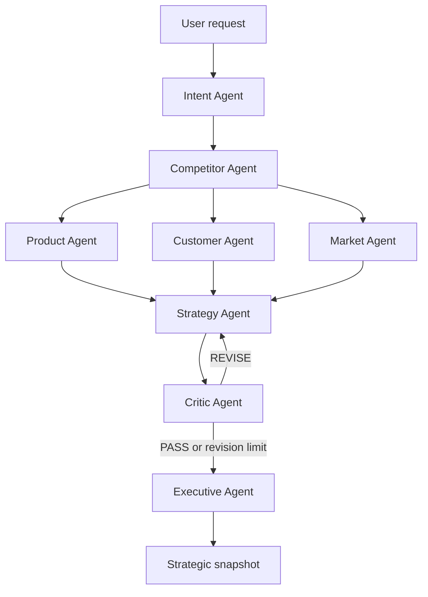

# Gambit

**Make your next move count.**

Gambit is a multi-agent competitive intelligence prototype that helps users research an existing company or explore a new business idea. It brings competitor, product, customer, and market analysis into a short strategic snapshot with a recommended next step and source links.

Built as a course project using **Python, LangChain, LangGraph, Gemini, and Tavily**.

## What it does

- Supports both existing companies and startup ideas.
- Researches named competitors and relevant alternatives.
- Examines offerings, customer needs, and market trends.
- Combines findings into a strategic recommendation.
- Reviews the recommendation through a bounded critic loop.
- Displays the final report and saves a Markdown copy.

## How it works

Eight agents share one Gemini model. Each agent has its own instructions and tool permissions. LangGraph manages the workflow, while `GambitState` carries findings between nodes.



| Agent | Responsibility |
| --- | --- |
| Intent | Identify the request type and extract business context |
| Competitor | Find relevant competitors and alternatives |
| Product | Compare offerings, differentiation, and available pricing |
| Customer | Examine pain points, priorities, feedback, and unmet needs |
| Market | Identify important trends, opportunities, and threats |
| Strategy | Combine findings and recommend an action |
| Critic | Review evidence support, assumptions, and confidence |
| Executive | Produce a concise report in clear language |

Product, Customer, and Market form parallel research branches. The critic can request up to two strategy revisions. Once that limit is reached, the workflow proceeds to the final report even if review concerns remain.

## Model and search

- **Gemini** performs reasoning and generates the analyses and final report. The notebook configures `gemini-3.5-flash-lite`.
- **Tavily** retrieves general web results and publicly indexed LinkedIn pages.
- Search calls use `include_answer=False`, so agents receive source snippets and links rather than a Tavily-generated answer.

The general search function retains the name `google_search`, but its implementation uses **Tavily**, not Google Search grounding.

## Getting started

The notebook is designed for **Google Colab**.

1. Upload the final notebook to this repository, then open it in Colab. The supplied final file is named `Gambit (1).ipynb`; you can rename it to `Gambit.ipynb` for the repository.
2. In Colab’s **Secrets** panel, add `GEMINI_API_KEY` and `TAVILY_API_KEY`.
3. Enable notebook access for both secrets.
4. Run the cells from top to bottom. The installation cell installs the required packages.
5. Enter a company or startup idea with its city or country when prompted.
6. Run the final save cell to create a Markdown report.

Use API keys with access to the configured services and available quota. Keep keys out of source code and clear sensitive notebook outputs before publishing.

### Example requests

```text
Analyze Zain in the telecommunications industry in Saudi Arabia.
```

```text
I want to open a French bakery in Riyadh, Saudi Arabia.
```

## Output

| Existing company | Startup idea |
| --- | --- |
| Overall assessment | BUILD, VALIDATE FIRST, or RECONSIDER verdict |
| Biggest competitive threat | Customer problem and need |
| Biggest customer insight | Named competitors or alternatives |
| Biggest opportunity and competitive gap | Market gap |
| Recommended action | Recommended next step |
| Confidence level and key sources | Confidence level and key sources |

The report is available in:

```python
final_state["final_snapshot"]
```

The save cell writes `GAMBIT_Snapshot_<timestamp>.md` to the notebook’s working directory. Download it through Colab’s file browser.

## Limitations

Gambit is a research prototype. Important claims and recommendations need human checking.

- Sources and snippets may be incomplete, outdated, or incorrectly interpreted.
- Multiple agent and tool calls can increase execution time and trigger API quota errors.
- Intent and Critic outputs use manual JSON parsing, which can fail on malformed responses.
- The critic revises Strategy using existing research and cannot gather missing evidence.
- Reaching the revision limit forces the routing decision to PASS; it does not establish factual correctness.
- Confidence labels are model judgments, not calibrated probabilities or measured accuracy.

## Future improvements

- Shared research to reduce repeated searches.
- Structured outputs and explicit evidence tracking.
- Routing evidence gaps back to research agents.
- Clarification when essential user context is missing.
- Better request pacing and retry handling.

## Author

**Lama Aldakheelallah**
